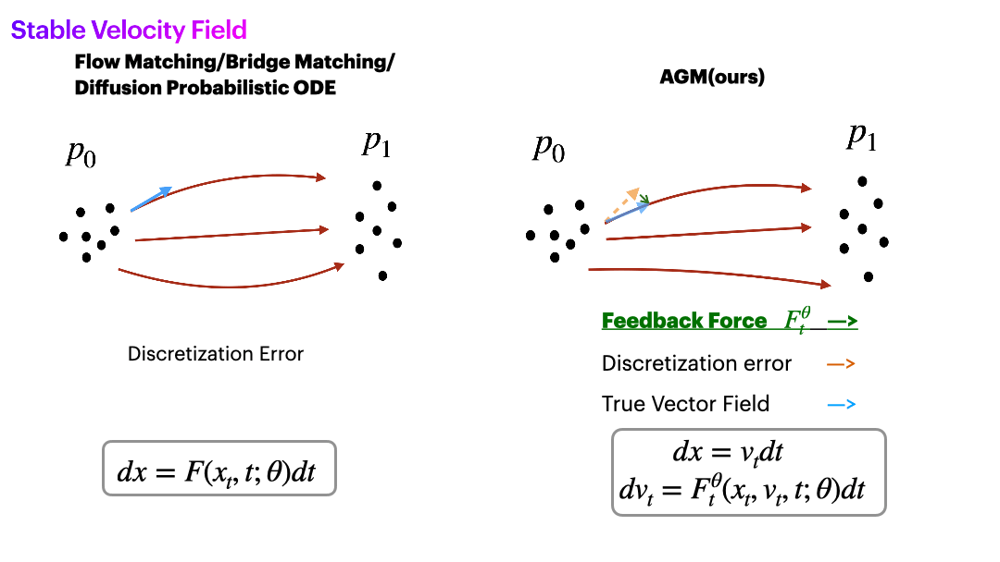
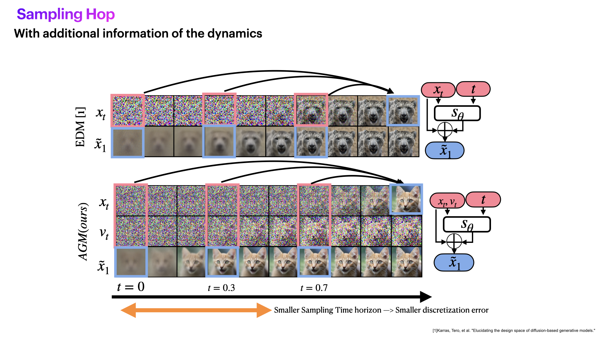
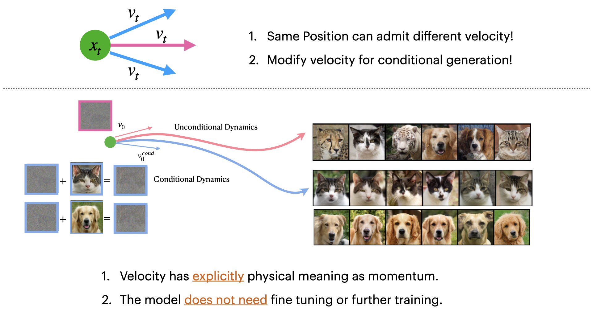

# Acceleration Model

This is the official Repo for [GENERATIVE MODELING WITH PHASE STOCHASTIC
BRIDGES](https://openreview.net/forum?id=tUtGjQEDd4&referrer=%5BAuthor%20Console%5D(%2Fgroup%3Fid%3DICLR.cc%2F2024%2FConference%2FAuthors%23your-submissions)) (ICLR 2024 Oral).

Abstract:
*Diffusion models (DMs) represent state-of-the-art generative models for continuous inputs. DMs work by constructing a Stochastic Differential Equation (SDE)
in the input space (ie, position space), and using a neural network to reverse it.
In this work, we introduce a novel generative modeling framework grounded in
phase space dynamics, where a phase space is defined as an augmented space
encompassing both position and velocity. Leveraging insights from Stochastic
Optimal Control, we construct a path measure in the phase space that enables efficient sampling. In contrast to DMs, our framework demonstrates the capability
to generate realistic data points at an early stage of dynamics propagation. This
early prediction sets the stage for efficient data generation by leveraging additional
velocity information along the trajectory. On standard image generation benchmarks, our model yields favorable performance over baselines in the regime of
small Number of Function Evaluations (NFEs). Furthermore, our approach rivals
the performance of diffusion models equipped with efficient sampling techniques,
underscoring its potential as a new tool generative modeling.*

---
## Fast Sampling with Stable Velocity
Here is the demo illustrating how the AGM achieves stable and rapid sampling. Essentially, we are learning the appropriate term for the velocity, which in turn corrects any deviations in the trajectory from the accurate solution.
<p align="center">
  
  
</p>
<!-- <div align="left">
    
</div>
<div align="right">
    
</div> -->

---

## Stroke-based Generative Modeling
We can achieve stroke based Generative Modeling without further fine tuning and training given pretrained AGM model.
<div align="center">
    
</div>

---
## Requirement
For `pip` installation:
```
bash setup/setup.sh
```
For `Conda` installation:
```
conda env create -f setup/environments.yml
conda activate agm
bash setup/conda_install.sh
```
---
## **Training**
* **Download dataset**: You need to download the dataset and put the file under `/dataeset/`. `CIFAR-10` is download autmomatically. For `AFHQv2` and `Imagenet` we follow the same pipline as EDM. The example command line code for downloading the AFHQv2 can be found in the comment line in `setup/setup.sh`. You may have to download `Imagenet` dataset by yourself by following [EDM](https://github.com/NVlabs/edm) repo.

* **Training**:Here we provide the command line for reproducing training used in our paper. You can add the argument `--log-writer wandb --wandb-user [Your-User-Name] --wandb-api-key [Your-Wandb-Key]` for monitoring the training process.

**Toy**
```
python train.py --name train-toy/sde-spiral      --exp toy --toy-exp spiral                                  #SDE
python train.py --name train-toy/ode-spiral      --exp toy --toy-exp spiral --DE-type probODE --solver gDDIM #ODE
```
**Cifar10**:
```
python train.py --name cifar10-repo --exp cifar10 --n-gpu-per-node 8
```
**AFHQv2**:
```
python train.py --name AFHQv2-repo --exp AFHQv2 --n-gpu-per-node 8
```
**ImageNet64**:
```
python train.py --name imagenet-repo --exp imagenet64        --n-gpu-per-node 8 --exp imagenet64 --num-itr 5000000 # Unconditional Generation
```
---
## **Sampling**
Before sampling, make srue you download the checkpoint and store them in `results/Cifar10-ODE/`,`results/AFHQv2-ODE/` and `results/uncond-ImageNet64-ODE/` folder.

Here we provide a short example generation command of generating 64 images on single RTX 3090 for CIFAR10, AFHQv2 and Imagenet:
```
bash scripts/example.sh
```
The corresponding generating time on single RTX 3090 is as following:
|           |NFE |  ETA time |
|----------|----------|----------|
| CIFAR-10 | 20     | ~6 sec |
| AFHQv2   | 20     | ~10 sec |
| ImageNet | 20     | ~15 sec   |

 ### **Toy datast Generation**: 
When you have trained the model, you can load it for fast sampling:
 ```
 #SDE with 10 NFEs
 python train.py --name train-toy/sde-spiral-eval --exp toy --toy-exp spiral --eval --nfe 10 --ckpt train-toy/sde-spiral                                    
 #ODE with 10 NFEs
 python train.py --name train-toy/ode-spiral-eval --exp toy --toy-exp spiral --eval --nfe 10 --DE-type probODE --solver gDDIM --ckpt train-toy/ode-spiral
 ```

### **CIFAR-10 Generation and Evaluation**
Using following command line to generate data. The generated images will be saved in `EVAL/cifar10-nfe[x]`
```
#NFE=5 FID=11.88 #4.5mins for sampling 50k images
python sampling.py  --n-gpu-per-node 1  --ckpt --ckpt Cifar10-ODE/latest.pt --pred-x1 --solver gDDIM  --T 0.4 --nfe 5 --fid-save-name cifar10-nfe5  --num-sample 50000 --batch-size 1000

#NFE=10 FID=4.54
python sampling.py  --n-gpu-per-node 1  --ckpt --ckpt Cifar10-ODE/latest.pt --pred-x1 --solver gDDIM  --T 0.7 --nfe 10 --fid-save-name cifar10-nfe10  --num-sample 50000 --batch-size 1000

#NFE=20 FID=2.58
python sampling.py  --n-gpu-per-node 1  --ckpt --ckpt Cifar10-ODE/latest.pt --pred-x1 --solver gDDIM  --T 0.9 --nfe 20 --fid-save-name cifar10-nfe20  --num-sample 50000 --batch-size 1000 
```
Evaluate the FID using EDM evaluation:
```
# x can be in {5,10,20}
torchrun --standalone --nproc_per_node=1 edm/fid.py calc --images=FID_EVAL/cifar10-nfe[x] --ref=https://nvlabs-fi-cdn.nvidia.com/edm/fid-refs/cifar10-32x32.npz
```

### **AFHQv2 Generation and Evaluation**
Using following command line to generate data. The generated images will be saved in `EVAL/AFHQv2-nfe[x]`
```
#Stroke-based generation
python sampling.py  --n-gpu-per-node 1  --ckpt AFHQv2-ODE/latest.pt  --pred-x1 --solver gDDIM  --save-img  --img-save-name stroke-AFHQv2 --nfe 100 --T 0.999 --num-sample 64 --batch-size 64 --stroke-path dataset/StrokeData/testFig0.png --stroke-type dyn-v # [you can also replace --stroke-type by init-v]

#Impainting generation
python sampling.py  --n-gpu-per-node 1  --ckpt AFHQv2-ODE/latest.pt  --pred-x1 --solver gDDIM  --save-img  --img-save-name impainting-AFHQv2 --nfe 100 --T 0.999 --num-sample 64 --batch-size 64 --stroke-path dataset/StrokeData/testFig0_impainting.png --stroke-type dyn-v --impainting

#NFE 20 FID=3.72
python sampling.py  --n-gpu-per-node 1  --ckpt AFHQv2-ODE/latest.pt  --pred-x1 --solver gDDIM  --fid-save-name AFHQv2-nfe20 --nfe 20 --T 0.9    --num-sample 50000 --batch-size 250
```
Evaluate the FID using EDM evaluation:
```
torchrun --standalone --nproc_per_node=1 edm/fid.py calc --images=FID_EVAL/AFHQv2-nfe20 --ref=https://nvlabs-fi-cdn.nvidia.com/edm/fid-refs/afhqv2-64x64.npz
```

### **Imagenet64 Generation and Evaluation**
Using following command line to generate data. The generated images will be saved in `EVAL/AFHQv2-nfe[x]`
```
#NFE 20 FID=10.55
python sampling.py  --n-gpu-per-node 1  --ckpt uncond-ImageNet64-ODE/latest.pt  --pred-x1 --solver gDDIM  --fid-save-name ImageNet64-nfe20 --nfe 20 --T 0.99    --num-sample 50000 --batch-size 100
#NFE 30 FID=10.07
python sampling.py  --n-gpu-per-node 1  --ckpt uncond-ImageNet64-ODE/latest.pt  --pred-x1 --solver gDDIM  --fid-save-name ImageNet64-nfe30 --nfe 30 --T 0.99    --num-sample 50000 --batch-size 100
#NFE 40 FID=10.10
python sampling.py  --n-gpu-per-node 1  --ckpt uncond-ImageNet64-ODE/latest.pt  --pred-x1 --solver gDDIM  --fid-save-name ImageNet64-nfe40 --nfe 40 --T 0.9    --num-sample 50000 --batch-size 100

```
Evaluate the FID using EDM evaluation (x is in [20,40]):
```
torchrun --standalone --nproc_per_node=1 edm/fid.py calc --images=FID_EVAL/ImageNet64-nfe[x] --ref=https://nvlabs-fi-cdn.nvidia.com/edm/fid-refs/imagenet-64x64.npz
```